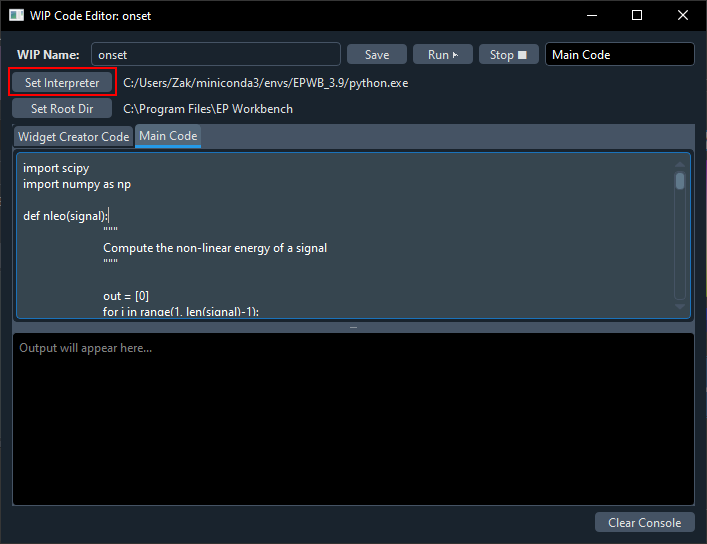
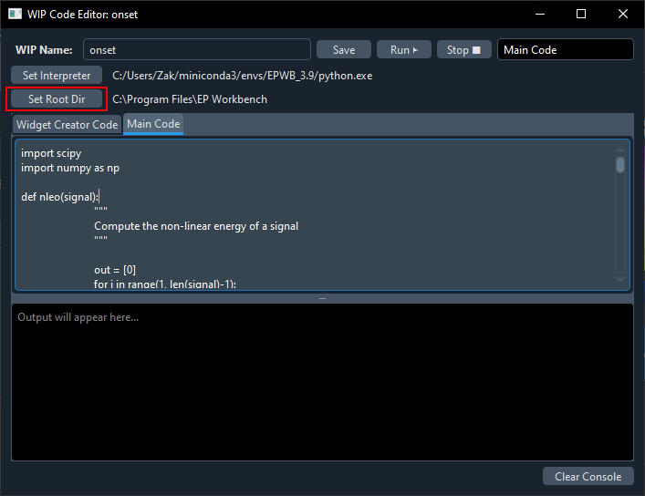
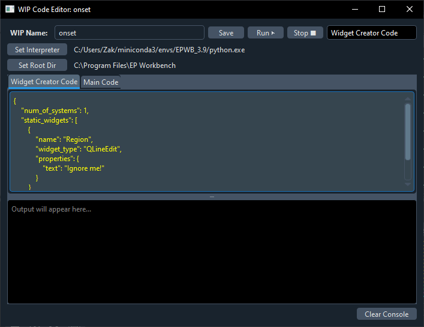
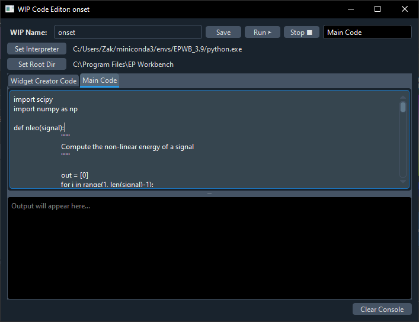
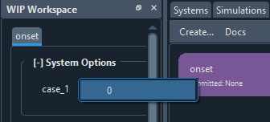

# Automatic Annotation of Electrograms

Calculating annotations of electrograms on EP Workbench.

> **NOTE:** This WIP is compatible with EP Workbench's Work-in-Progress Module.

## Pre-requisites

- **Conda** (or your preferred Python environment) is installed.

## How to Install a WIP

1. Ensure all pre-requisites are installed on your computer (see above).

2. Clone this repository:

```bash
git clone <repository-url>
```
   
3. Go to the directory you just cloned and do the following:

```bash
conda create -n wip python=3.10 pip
conda activate wip

which python  # save this env python path for later
pip install -r requirements.txt

```
Your conda environment is now ready!

4. Now open up EP Workbench, and navigate to the tab on the right called `Work-in-Progress` > Click `Create ...`, then press on the `code` button.


5. Fill the WIP Code Editor as follows:

   1. `WIP Name` \<preferred name for this wip\>

   2. `Interpreter` Set the conda environment, this can be found as mentioned above (path to env python)



   3. `Root directory` The root directory must be of the disk where the cases are loaded from. For example, if the data is stored somewhere on C:\, the root directory must start with C:\.



   4. `Widget Creator Code` Copy-paste from widget.json



   5. `Main Code` Copy-paste from the Python file of the annotation you want:
	- To annotate bipolar electrogram onset, use code in onset.py
	- To annotate bipolar electrogram offset (Last Deflection), use code in offset.py



   6. `Press` SAVE!

7. Press on the Widget creator code tab and then press the run button. You can now close this window.


> **NOTE:** Once saved the WIPs settings persist between sessions.


## How to Run the WIP


1. Load the `OpenEP` case in `EP Workbench`.

2. Fill in the user-inputs in the WIP Workspace by selecting the case to automatically annotate in the WIP Workspace window.



3. Press the Run button.

> **NOTE:** (Optional) See live outputs on the Code > Output Console Window.
---

`Author` Ali-Razak Rashid (ali-razak.rashid@kcl.ac.uk)

`Co-Author and Special Thanks` Vinush Vigneswaran (vvignesw@ed.ac.uk)

`OpenEP` https://openep.discourse.group/

---

